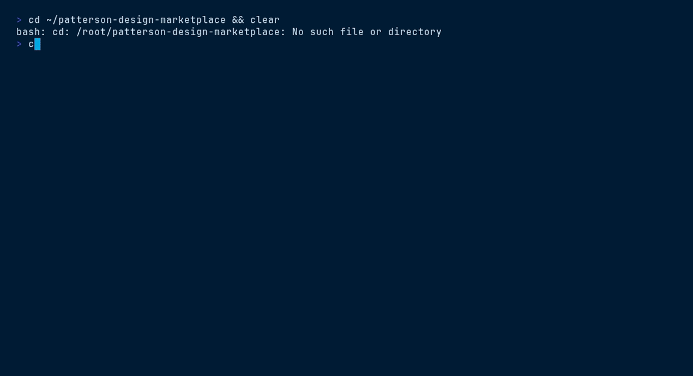

<!-- @template name="TutorialKit" description="Patterson-branded TutorialKit starter — a themed interactive-tutorial platform with a 5-part, 18-lesson agent-tooling curriculum." -->
# Template — Patterson TutorialKit

A ready-to-run [TutorialKit](https://tutorialkit.dev) project, skinned in the
Patterson Companies brand, shipping a full **5-part / 18-lesson** curriculum on
agent tooling. Copy this folder to run the workshop as-is or as a base for your
own. Canonical home: [github.com/patterson-agents/design-system](https://github.com/patterson-agents/design-system)
(`templates/tutorialkit/`).

## Run it

```sh
npm install
npm run dev        # boots the themed TutorialKit at http://localhost:4321
```

Other scripts: `npm run build`, `npm run preview`, `npm run check` (`astro check`).

## What's branded, and where

| Concern | File | Notes |
|---------|------|-------|
| **Theme** | `theme.css` | The full `--tk-*` surface mapped to Patterson tokens. Four selectable themes via `data-theme`: `light` (default), `dark` (navy canvas), `dental` (sky-forward), `veterinary` (teal/green). TutorialKit auto-imports it from the project root. Ends with a small "component reinforcement" block that binds the brand to the two surfaces TutorialKit doesn't token by default (the top-bar background and markdown prose). |
| **Logo** | `public/logo.svg`, `public/logo-dark.svg` | The Patterson wordmark on the navy top bar (white lockup works in both modes). |
| **Astro config** | `astro.config.mjs` | Standard `@tutorialkit/astro` wiring (dev toolbar off). |
| **UnoCSS** | `uno.config.ts` | Wires UnoCSS to the `@tutorialkit/theme` preset so the shell's utility/icon classes are generated. **Required** — without it the top bar collapses and icons vanish. |
| **Collection** | `src/content/config.ts` | Declares the `tutorial` content collection with TutorialKit's `contentSchema` (also what `astro check` validates against). |
| **Content** | `src/content/tutorial/` | The lessons. Numbered folders set order; each level has a `meta.md`, lessons add `content.md`. |
| **Base workspace** | `src/templates/default/` | The starter filesystem booted into the WebContainer; lesson `_files/` are layered on top. **Required** — its absence 404s `template-default.json`. |

To re-theme, edit `theme.css` only — every value traces back to a Patterson brand
primitive (navy `#003767`, sky `#00A8E1`, cool grays, and the teal/blue/amber/red
semantic set). A live, install-free preview of the themed shell lives at
`../../ui_kits/tutorialkit/index.html`.

> Built and verified against TutorialKit **1.6** (Astro 4). The theme is loaded
> via TutorialKit's variable system; a handful of `--tk-*` tokens the default
> chrome doesn't consume in 1.6 are reinforced at the bottom of `theme.css`.

> **Security note (Astro version).** `@tutorialkit/astro@1.6.0` — the latest
> TutorialKit release — pins `astro: ^4.15.0`, so this starter resolves Astro 4.
> Several Astro advisories are patched only in Astro 5/6, which TutorialKit does
> not yet support; the affected paths (SSR host-header handling, server islands,
> middleware auth, dev-server file access) are not exercised by a static,
> locally-run tutorial, so real-world exposure here is low. If you deploy this as
> a server-rendered (SSR) site or expose the Astro dev server, review the current
> Astro advisories first. The pin lifts — and Astro should be upgraded — once
> TutorialKit ships an Astro-5+ compatible release.

> [!WARNING]
> **`package.json` and `bun.lock` currently disagree — do not run a plain
> `bun install` here until this is resolved.** `package.json` asks for
> `astro: ^7.1.3` and `@astrojs/react: ^6.0.1`; `bun.lock` resolves
> `astro@4.16.19` and `@astrojs/react@3.6.3`. The lockfile is the half that
> works — install from it and the template builds (19 pages). Resolve the
> manifest instead and the build fails at config load:
>
> ```
> Package subpath './jsx/renderer.js' is not defined by "exports" in
> node_modules/astro/package.json imported from node_modules/@astrojs/mdx/dist/index.js
> ```
>
> The divergence came from two Dependabot commits that bumped the manifest
> without regenerating the lockfile (`6260f00` astro ^4.15.0 → ^7.1.3, and
> `0bdc85d` @astrojs/react 3.6.2 → 6.0.1, both 2026-07, in the
> `patterson-design-plugins` history this template was carried over from).
>
> The ceiling is a hard **dependency**, not a soft peer range —
> `@tutorialkit/astro@1.6.0` depends on `@astrojs/mdx: ^3.1.1`, and
> `@astrojs/mdx@3.x` imports `astro/jsx/renderer.js`, a subpath Astro removed
> after v4. Verified 2026-08-12: astro **4.16.19 builds**, **5.18.2 fails**,
> **7.2.1 fails**, all against `@tutorialkit/*@1.6.0`.
>
> Restoring the manifest to `astro@4.16.19` makes the template reproducible
> again, but pins a version carrying a `[high]` CVE alert (Socket vulnerability
> score 64; `bun audit` reports 16 advisories for `astro <5.15.9`, 4 of them
> high). That trade-off is a maintainer decision and is why this is documented
> rather than silently pinned. Whichever way it goes, add a Dependabot `ignore`
> for `astro` and `@astrojs/react` on this path so the manifest cannot drift
> ahead of what TutorialKit can actually resolve.
>
> Upstream status as of 2026-08-12: `@tutorialkit/astro` latest is **1.6.0**
> (released 2025-09-01), last push to `stackblitz/tutorialkit` 2025-12-04, repo
> not archived, and **no upstream issue tracks Astro 5+ support** — so there is
> no tracking link to cite here.

## The curriculum

| Part | Chapter | Lessons |
|------|---------|---------|
| **1 · Foundations** | Design tokens | Define the Patterson brand tokens |
| **2 · Agent Context Files** | Teaching agents your project | AGENTS.md · CLAUDE.md · design.md |
| **3 · Agent Skills** | Writing skills | Your first SKILL.md · Progressive disclosure |
| **4 · Extending Claude Code** | MCP / Plugins / Marketplaces | Wire up an MCP server · The plugin manifest · Publish a marketplace |
| **5 · The Patterson Marketplace** | Core / Templates / UI kits | One lesson per plugin: brand, deck, executive-deck, corporate-page, file-manager, docs, tutorialkit, corporate-website, storefront |

Every lesson follows the same **author → validate** loop (below). The lesson
sources ground rules in the official docs: the Agent Skills spec
(agentskills.io), Claude Code's skills/plugins/marketplaces references, and the
real `patterson-design` marketplace at `patterson-agents/design-system`.

`index.html` is an install-free preview of the themed shell **with the full
lesson tree**: breadcrumb navigation, per-lesson editor, and a simulated
validator that runs the same checks as each lesson's `validate.mjs`
(`lessons-data.js` is generated from `src/content/tutorial` — regenerate it when
lessons change).

## The lesson model — author→validate

TutorialKit lessons run in a **WebContainer** (Node compiled to the browser), which
can't run AI agents or make network calls. So the hands-on loop is always:

1. The learner **authors an artifact** in the editor.
2. The learner **runs a Node validator** in the terminal.
3. The terminal shows **pass/fail** — instant, checkable feedback.

Each lesson's `_files/` is the starting state (with a deliberate gap or mistake);
`_solution/` (the **Solve** button) is the finished artifact; `validate.mjs` is a
dependency-free Node checker.

## Add your own lesson

```
src/content/tutorial/
  <n>-part/meta.md            # type: part
    <n>-chapter/meta.md       # type: chapter
      <n>-lesson/
        content.md            # type: lesson + the markdown body
        _files/               # editor starting state (+ validate.mjs)
        _solution/            # completed state (+ identical validate.mjs)
```

Set `focus:` to a file that exists in `_files/`, keep `previews: false` for
author→validate lessons, and derive any `ins={…}`/`del={…}` code annotations from a
real `diff` between `_files` and `_solution`.

## VHS terminal demo


